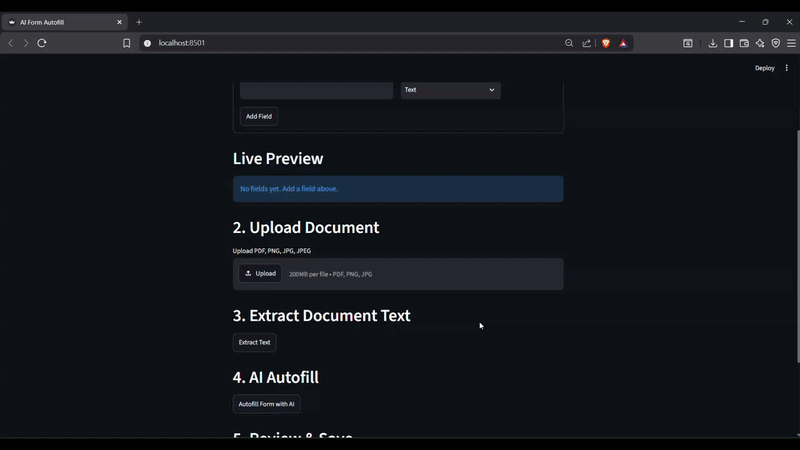

# AI Form Builder & Document Autofill

A Streamlit application that allows users to create custom forms dynamically and automatically populate them using information extracted from uploaded documents.

The application combines PDF parsing, OCR, and Google's Gemini model to convert unstructured documents into structured, editable forms.

---

## Demo

```markdown

```

---

## Why I built this

Most document processing solutions rely on predefined templates or hardcoded extraction logic. I wanted to explore a schema-driven approach where the form itself is created dynamically by the user, allowing the same application to adapt to different document types using a Large Language Model.

---

## Features

- Dynamic form creation
- Multiple field types
  - Text
  - Multiline Text
  - Number
  - Date
  - Dropdown
  - Checkbox
- PDF and image upload
- Hybrid text extraction
  - `pdfplumber` for digital PDFs
  - `pytesseract` OCR fallback for scanned PDFs and images
- AI-powered schema-driven information extraction using Google Gemini
- Editable autofilled form
- Required field validation
- Export final output as JSON

---

## Tech Stack

| Component | Technology |
|-----------|------------|
| Language | Python |
| UI | Streamlit |
| OCR | pytesseract |
| PDF Parsing | pdfplumber |
| AI Model | Google Gemini 2.5 Flash |
| Image Processing | Pillow |
| Environment Variables | python-dotenv |

---

## Workflow

```
Document
    │
    ▼
Text Extraction
(pdfplumber / OCR)
    │
    ▼
Gemini
(Document + Form Schema)
    │
    ▼
Structured JSON
    │
    ▼
Populate Dynamic Form
    │
    ▼
Review & Save
```

---

## Installation

Clone the repository

```bash
git clone https://github.com/sahishnutsa/ai-form-autofill.git
cd ai-form-autofill
```

Install dependencies

```bash
pip install -r requirements.txt
```

Install Tesseract OCR

**Ubuntu**

```bash
sudo apt install tesseract-ocr
```

**macOS**

```bash
brew install tesseract
```

**Windows**

Download and install Tesseract OCR and ensure it is added to your system PATH.

Create a `.env` file

```text
GEMINI_API_KEY=your_api_key_here
```

Run the application

```bash
streamlit run app.py
```

---

## Project Structure

```
.
├── app.py
├── llm.py
├── requirements.txt
├── README.md
└── .env.example
```

---

## Future Improvements

- Database-backed storage
- Form templates
- Confidence score for extracted values
- Export to PDF/CSV
- Batch document processing

---